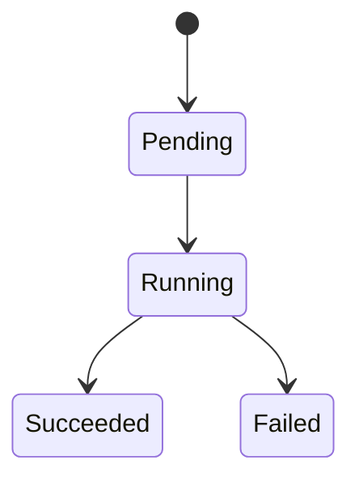

# kube-notes

Notes for kubernetes

- CIDR: https://aws.amazon.com/cn/what-is/cidr/#:~:text=Classless%20Inter%2DDomain%20Routing%20(CIDR)%20allows%20network%20routers%20to,specified%20by%20the%20CIDR%20suffix.
- Everything you need to know about Nodes: https://www.weave.works/blog/kubernetes-node-everything-you-need-to-know
- Cracking Kubernetes Node Proxy: https://arthurchiao.art/blog/cracking-k8s-node-proxy/
- Google Kubernets Engine - Network Overview: https://cloud.google.com/kubernetes-engine/docs/concepts/network-overview
- Kubernetes Secure Internal Networking: https://medium.com/google-cloud/secure-kubernetes-internal-networking-5f2556f7efde
- Abbr in Kubernetes: https://blog.heptio.com/kubectl-resource-short-names-heptioprotip-c8eff9fb7202
- Goffinet.org About Containers and Kubernetes: https://containers.goffinet.org/containers/001-intro.html#introduction
- Minikube vs Kind vs k3s: https://shipit.dev/posts/minikube-vs-kind-vs-k3s.html
- Minikube Tutorial: https://minikube.sigs.k8s.io/docs/start/
- Kubectl Cheat Sheet: https://kubernetes.io/docs/reference/kubectl/cheatsheet/#bash
- Nginx Ingress Controller: https://kubernetes.github.io/ingress-nginx/user-guide/nginx-configuration/
- Ingress nginx for TCP and UDP services (Minikube): https://minikube.sigs.k8s.io/docs/tutorials/nginx_tcp_udp_ingress/
- https://www.yuque.com/u2022521/kb/fyt7gq


## Getting Started

### 1. Install Minikube

- Minikube Getting Started https://minikube.sigs.k8s.io/docs/start/

To install.

```sh
brew install minikube
```

Or download it directly :D

Minikube needs a driver, say, Docker. But, Dockerd is not available on MacOS, it only ships with a cli tool: the docker and docker-compose. We either install Docker Desktop or Colima.

- Colima Github https://github.com/abiosoft/colima

```sh
# install colima using homebrew
# if you are using a very old OS version, and there is no bottle for it, it may compile and it's extremely slow (at least for me)
brew install docker-compose
brew install docker
brew install colima

# or you may download and install it directly
curl -LO https://github.com/abiosoft/colima/releases/download/v0.5.4/colima-Darwin-x86_64
install colima-Darwin-x86_64 /usr/local/bin/colima

# and then start the colima
colima start
```

Unfortunately, my Mac is stil using Catalina OS, which is pretty old. Colima and its dependencies must be compiled rather than automatically downloaded and installed (for me by Homebrew, e.g., LLVM). I chose to use an old version of Docker Desktop (4.15.0).

Source: [Stackoverflow install-docker-on-macos-catalina](https://stackoverflow.com/questions/68373008/install-docker-on-macos-catalina)

```sh
# download Cask code for Docker Desktop 4.15.0,93002
curl https://raw.githubusercontent.com/Homebrew/homebrew-cask/1a83f3469ab57b01c0312aa70503058f7a27bd1d/Casks/docker.rb -O

# install Docker Desktop from Cask Code
brew install --cask docker.rb
```

### 2. Run Minikube

Start Minikube

```sh
minikube start
```

Start Minikube Dashboard, the dashboard is just what it's named. When it's ready, it opens up a new tab in your browser, and shows the 'Dashboard'.

```sh
minikube dashboard
```

The opened tab's url is like the following:

```
http://127.0.0.1:55901/api/v1/namespaces/kubernetes-dashboard/services/http:kubernetes-dashboard:/proxy/#/workloads?namespace=default
```

This command also serves as a proxy for us to access, by default the kubernetes network is not accessible externally. We can kill it by ctrl-c.

### 3. The Basic

In k8s, Pod is a group of one or more containers. K8s deployment monitors and controls the pod, and restart the containers in pod if necessary. The concept is very similar to the docker-compose and the docker world, but with a larger scale. Deployment is also reponsible for scaling pods.

To create a deployment:

```sh
# from the tutorial
kubectl create deployment hello-minikube --image=kicbase/echo-server:1.0
```

To list all deployments:

```sh
kubectl get deployments

# NAME         READY   UP-TO-DATE   AVAILABLE   AGE
# hello-node   0/1     1            0           7s
```

To list the pods:

```sh
kubectl get pods

# NAME                          READY   STATUS             RESTARTS   AGE
# hello-node-7b87cd5f68-76s74   0/1     ImagePullBackOff   0          4m25s
```

To list all pods:

```sh
kubectl get pods -A

# NAMESPACE              NAME                                        READY   STATUS             RESTARTS      AGE
# default                hello-node-779bd496d-shsmz                  0/1     ImagePullBackOff   0             6m49s
# kube-system            coredns-787d4945fb-pkdkt                    1/1     Running            0             38m
# kube-system            etcd-minikube                               1/1     Running            0             38m
# kube-system            kube-apiserver-minikube                     1/1     Running            0             38m
# kube-system            kube-controller-manager-minikube            1/1     Running            0             38m
# kube-system            kube-proxy-sfg57                            1/1     Running            0             38m
# kube-system            kube-scheduler-minikube                     1/1     Running            0             38m
# kube-system            storage-provisioner                         1/1     Running            1 (37m ago)   38m
# kubernetes-dashboard   dashboard-metrics-scraper-5c6664855-fnbxb   1/1     Running            0             37m
# kubernetes-dashboard   kubernetes-dashboard-55c4cbbc7c-hptc9       1/1     Running            0             37m
```

If you have followed the outdated tutorial, the pod may not start. For example, the `https://kubernetes.io/docs/tutorials/hello-minikube/` one.

But the experience is useful tho, the *ImagePullBackOff* error seemed to be a problem with pulling images from registry.
Another similar error that I found is "ErrImagePull". This can also be found on the Dashboard.

We can check the logs of the pod:

```sh
kubectl logs -p hello-node-7b87cd5f68-76s74

# Error from server (BadRequest): previous terminated container "agnhost" in pod "hello-node-7b87cd5f68-76s74" not found
```

This error msg states that the contain "agnhost" doesn't exist.

We can delete the deployment using the following command

```sh
kubectl delete deployment hello-node

# deployment.apps "hello-node" deleted
```

If everything goes right, then we have:

```sh
kubectl create deployment hello-minikube --image=kicbase/echo-server:1.0
# deployment.apps/hello-minikube created

kubectl get deployments
# NAME             READY   UP-TO-DATE   AVAILABLE   AGE
# hello-minikube   1/1     1            1           81s

kubectl get pods
# NAME                              READY   STATUS    RESTARTS   AGE
# hello-minikube-77b6f68484-dcfkn   1/1     Running   0          2m6s
```

We can expose the deployment by binding it's port to a specified port using `NodePort`. The `NodePort` according to minikube's handboook, is *"NodePort, as the name implies, opens a specific port, and any traffic that is sent to this port is forwarded to the service."* But the service is not externally accessible yet.

```sh
kubectl expose deployment hello-minikube --type=NodePort --port=8080

# service/hello-minikube exposed
```

We check services for this deployment:

```sh
kubectl get services hello-minikube

# NAME             TYPE       CLUSTER-IP    EXTERNAL-IP   PORT(S)          AGE
# hello-minikube   NodePort   10.97.53.50   <none>        8080:30856/TCP   117s
```

We then create a port-forward to 8080 for this specific service. The service exposes 8080 port, and we forward any traffic from 7080 to 8080. Then we have access to the service, using `http://localhost:7080`. *"Kubectl port-forward is a method to access, interact and manage internal Kubernetes clusters directly from your local network."*

```sh
kubectl port-forward service/hello-minikube 7080:8080

# Forwarding from 127.0.0.1:7080 -> 8080
# Forwarding from [::1]:7080 -> 8080
# Handling connection for 7080
# Handling connection for 7080
```

To stop the cluster:

```sh
minikube pause
```

To unpause the cluster:

```sh
minikube unpause
```

To halt the cluster:

```sh
minikube stop
```

To change configuration, e.g., default mem limit, require restart:

```sh
minikube config set memory 1234
```

To view configuration:

```sh
minikube config view
```

To list kubernetes addons (services that can be installed and used, such as minikube dashboard):

```sh
minikube addons list
```

Delete all minikube clusters:

```sh
minikube delete --all
```

### More Stuff

To access applications inside Kubernetes, we use services. There are two major cagegories:

- NodePort
- LoadBalancer

#### NodePort

NodePort is very straightforward, it opens a specific port, and the traffic sent to this port is forwarded to the service.

In minikube, we have the following shortcut to get the minikube's IP and the service's NodePort, it's not a kubernetes thing.

```sh
minikube service hello-minikube  --url

# http://127.0.0.1:61322
```

With this open, we can access the service using the url returned. Without the `--url` flag, we have:

```sh
minikube service hello-minikube

# |-----------|----------------|-------------|---------------------------|
# | NAMESPACE |      NAME      | TARGET PORT |            URL            |
# |-----------|----------------|-------------|---------------------------|
# | default   | hello-minikube |        8080 | http://192.168.49.2:30856 |
# |-----------|----------------|-------------|---------------------------|
# 🏃  Starting tunnel for service hello-minikube.
# |-----------|----------------|-------------|------------------------|
# | NAMESPACE |      NAME      | TARGET PORT |          URL           |
# |-----------|----------------|-------------|------------------------|
# | default   | hello-minikube |             | http://127.0.0.1:61342 |
# |-----------|----------------|-------------|------------------------|
```

These two commands open the tunnel for the service (it seems like it's a Drawin/Windows/WSL thing, and it's not needed on Linux. On Linux, no tunnel is created).

So **NodePort** is a type of service, we export the deployment using the NodePort service type, and then we use the port to access the service inside kubenetes. `minikube service` command is merely for certain type of OS.

```sh
# deployment created, not accessible yet
kubectl create deployment hello-minikube1 --image=kicbase/echo-server:1.0

# deployment exposed on port 8080
kubectl expose deployment hello-minikube1 --type=NodePort --port=8080
```

Using kubectl, we can check the service port binding.

```sh
kubectl get service hello-minikube

# NAME             TYPE       CLUSTER-IP    EXTERNAL-IP   PORT(S)          AGE
# hello-minikube   NodePort   10.97.53.50   <none>        8080:30856/TCP   167m
```

#### LoadBalancer

According to documentation: *"A LoadBalancer service is the standard way to expose a service to the internet. With this method, each service gets its own IP address."*

As usual, create a new deployment, but it's not exposed by any means.

```sh
# create deployment without exposing it
kubectl create deployment hello-minikube1 --image=kicbase/echo-server:1.0
```

Expose the deployment using the service type LoadBalancer.

```sh
kubectl expose deployment hello-minikube1 --type=LoadBalancer --port=8080
```

Then we get service to check the ip and port assigned for this service.

```sh
kubectl get service

# NAME              TYPE           CLUSTER-IP     EXTERNAL-IP   PORT(S)          AGE
# hello-minikube1   LoadBalancer   10.97.163.13   <pending>     8080:31170/TCP   11s
# kubernetes        ClusterIP      10.96.0.1      <none>        443/TCP          4h43m
```

Since we are running Minikube on Darwin (Mac OS), we always need to open a tunnel in order to connect to our exposed services.

```sh
minikube tunnel

# ✅  Tunnel successfully started
# 📌  NOTE: Please do not close this terminal as this process must stay alive for the tunnel to be accessible ...
# 🏃  Starting tunnel for service hello-minikube1.
```

Then the external IP for our exposed services should be assigned.

```sh
kubectl get service

# NAME              TYPE           CLUSTER-IP     EXTERNAL-IP   PORT(S)          AGE
# hello-minikube1   LoadBalancer   10.97.163.13   127.0.0.1     8080:31170/TCP   2m33s
# kubernetes        ClusterIP      10.96.0.1      <none>        443/TCP          4h46m
```

With this setup, we can access `hello-minikube1` through `http://127.0.0.1:8080`.

## Pushing Images To Minikube And Deploy Them

Say we have a Golang app with the following Dockerfile.

```dockerfile
FROM golang:1.18-alpine3.17 as build
LABEL author="Yongjie.Zhuang"

WORKDIR /go/src/build/

# for golang env
RUN go env -w GO111MODULE=on
RUN go env -w GOPROXY=https://mirrors.aliyun.com/goproxy/,direct

# dependencies
COPY go.mod .
COPY go.sum .

RUN go mod download

# build executable
COPY . .
RUN go build -o main


FROM alpine:3.17
WORKDIR /usr/src/
COPY --from=build /go/src/build/main ./main
COPY --from=build /go/src/build/app-conf-dev.yml ./app-conf-dev.yml
EXPOSE 8080

CMD ["./main"]
```

Then we build it with following command:

```sh
docker build . -t empty-head:latest
```

We can list the images using:

```sh
docker images

# REPOSITORY       TAG       IMAGE ID       CREATED          SIZE
# empty-head       latest    9770f9061f21   59 minutes ago   27.1MB
```

Verify the image actually runs:

```sh
docker run -p 8080:8080 9770f9061f21
```

Then we push the image to Minikube:

- About pushing images to minikube: https://minikube.sigs.k8s.io/docs/handbook/pushing/

```sh
minikube image load empty-head:latest
```

We can check that the image is actually inside Minikube, which is the "docker.io/library/empty-head:latest"

```sh
minikube image list

# registry.k8s.io/pause:3.9
# registry.k8s.io/kube-scheduler:v1.26.3
# registry.k8s.io/kube-proxy:v1.26.3
# registry.k8s.io/kube-controller-manager:v1.26.3
# registry.k8s.io/kube-apiserver:v1.26.3
# registry.k8s.io/ingress-nginx/kube-webhook-certgen:<none>
# registry.k8s.io/ingress-nginx/controller:<none>
# registry.k8s.io/etcd:3.5.6-0
# registry.k8s.io/e2e-test-images/agnhost:2.39
# registry.k8s.io/coredns/coredns:v1.9.3
# gcr.io/k8s-minikube/storage-provisioner:v5
# gcr.io/k8s-minikube/minikube-ingress-dns:<none>
# docker.io/library/empty-head:latest
# docker.io/kubernetesui/metrics-scraper:<none>
# docker.io/kubernetesui/dashboard:<none>
# docker.io/kicbase/echo-server:1.0
```

Get the deployment file for our deployment:

```sh
kubectl create deployment empty-head --image=docker.io/library/empty-head:latest -o yaml --dry-run=client > empty-head.yaml
```

which has the following content:

```yaml
apiVersion: apps/v1
kind: Deployment
metadata:
  creationTimestamp: null
  labels:
    app: empty-head
  name: empty-head
spec:
  replicas: 1
  selector:
    matchLabels:
      app: empty-head
  strategy: {}
  template:
    metadata:
      creationTimestamp: null
      labels:
        app: empty-head
    spec:
      containers:
      - name: empty-head
        image: docker.io/library/empty-head:latest
        resources: {}
status: {}
```

Then we add the imagePullPolicy, setting it to Never, so that it will actually use our cached docker image.

```yaml
apiVersion: apps/v1
kind: Deployment
metadata:
  creationTimestamp: null
  labels:
    app: empty-head
  name: empty-head
spec:
  replicas: 1
  selector:
    matchLabels:
      app: empty-head
  strategy: {}
  template:
    metadata:
      creationTimestamp: null
      labels:
        app: empty-head
    spec:
      containers:
      - image: docker.io/library/empty-head:latest
        name: empty-head
        resources: {}
        imagePullPolicy: Never # CHANGED HERE!!!
status: {}
```

Lets create a deployment for it.

```sh
kubectl create -f empty-head.yaml

# deployment.apps/empty-head created
```

Once we have deployment created, we expose it as service.

```sh
kubectl expose deployment empty-head --type=NodePort --port=8080
```

This app handles "https://0.0.0.0:8080/ping" endpoint. So we can do the following to request it:

```sh
kubectl expose deployment empty-head --type=NodePort --port=8080
# service/empty-head exposed

kubectl get service
# NAME         TYPE        CLUSTER-IP      EXTERNAL-IP   PORT(S)          AGE
# empty-head   NodePort    10.100.248.90   <none>        8080:32685/TCP   5s
# kubernetes   ClusterIP   10.96.0.1       <none>        443/TCP          8h
# photon@Yongjie ~$ mk service empty-head
# |-----------|------------|-------------|---------------------------|
# | NAMESPACE |    NAME    | TARGET PORT |            URL            |
# |-----------|------------|-------------|---------------------------|
# | default   | empty-head |        8080 | http://192.168.49.2:32685 |
# |-----------|------------|-------------|---------------------------|
# 🏃  Starting tunnel for service empty-head.
# |-----------|------------|-------------|------------------------|
# | NAMESPACE |    NAME    | TARGET PORT |          URL           |
# |-----------|------------|-------------|------------------------|
# | default   | empty-head |             | http://127.0.0.1:53441 |
# |-----------|------------|-------------|------------------------|
# 🎉  Opening service default/empty-head in default browser...
# ❗  Because you are using a Docker driver on darwin, the terminal needs to be open to run it.

curl http://127.0.0.1:53441/ping
# pong at 2023-04-27 11:29:39.135640338 +0000 UTC m=+240.537862673
```

## Concepts

### Kubernetes Objects

- src: https://kubernetes.io/docs/concepts/overview/working-with-objects/kubernetes-objects/

Kubernetes objects are decribed as *"... a record of intent"*. These objects describe:

- what containerized applications are running (on which nodes)
- resources avaliable to them
- policies around how they behave

Kubernetes objects are created, modified and deleted using **Kubernetes API**, and `Kubectl` use the API as well.

Almost every kubernetes objects have to nested object fields:

- spec: describe its desired state
- status: describe its current status, and is updated by kubernetes

**Object Spec** is especially important for object creation.

We write **".yaml"** file to describe a kubernetes object, `Kubectl` converts the deployment file to a `json` payload and make necessary API call to Kubernetes.

Example of kubenetes deployment file:

```yaml
# deployment.yaml
apiVersion: apps/v1
kind: Deployment
metadata:
  name: nginx-deployment
spec:
  selector:
    matchLabels:
      app: nginx
  replicas: 2 # maintain 2 pods
  template:
    metadata:
      labels:
        app: nginx
    spec:
      containers:
      - name: nginx
        image: nginx:1.14.2
        ports:
        - containerPort: 80
```

Then we use kubectl to create the kubenetes object:

```sh
# we can also use 'kubectl create -f deployment.yaml' (they are different kind of cmds tho)
kubectl apply -f deployment.yaml
```

In the **deploymnet file**, the following fields are required:

- **apiVersion**: the kubernetes API version we will be using (e.g., for `kubectl`)
- **kind**: kind of object
- **metadata**: metadata needed to uniquely identify the object, e.g., `name`, `UID`, `namespace`
- **spec**: the desired state for the object

The documentation of these fields can be found in [Kubernetes API](https://kubernetes.io/docs/reference/kubernetes-api/). For deployment, it's in [Workload Resources - Deployment](https://kubernetes.io/docs/reference/kubernetes-api/workload-resources/deployment-v1/).

### Object Name and UID

Each kubernetes object is uniquely identified by `Name` and `UID`. `UID` is generated by Kubernetes, it's essentially UUID.

`Name` is specified by deployment file in `'metadata.name'`. It must be unique for that type of the resource. ***"API resources are distinguished by their API group, resource type, namespace, and name."***

### Labels and Selectors

Labels add additional key/value attributes to Kubernetes objects, each key must be unique for the object. These are specified under `'metadata.labels'`.

For example, the below Pod resource contains two labels.

```yaml
apiVersion: v1
kind: Pod
metadata:
  name: label-demo
  labels:
    environment: production
    app: nginx
```

Labels without a prefix is private to the users. Prefix is a valid DNS subdomain names, and these shared prefix ensure that the custom label are not interfered with others. E.g.,

```yaml
metadata:
  labels:
    app.kubernetes.io/name: myapp
```


### Label Selctors

With Label Selector, we can identify a set of objects through labesl. Kubernetes supports two types of selectors:

- Equality-based selector (i.e., `==`, `!=`, we can also use `=`, it's the same as `==`)
- Set-based selector (i.e., `in`, `notin`)

When specifying multiple requirements, we can use comma as delimiter, and comma separator acts as **logical and operator**. E.g., `environment!=prod,tier!=frontend`, is interprted as label 'environment' not equals to 'prod' and label 'tier' not equals to 'frontend'. Selectors are `spec`s.

For example,

```yaml
apiVersion: v1
kind: Pod
metadata:
  name: cuda-test
spec:
  containers:
    - name: cuda-test
      image: "registry.k8s.io/cuda-vector-add:v0.1"
      resources:
        limits:
          nvidia.com/gpu: 1
  nodeSelector:
    accelerator: nvidia-tesla-p100
```

This Pod selects nodes that match `'accelerator=nvidia-tesla-p100'`, and it's equivalent to `'accelerator in (nvidia-tesla-p100)'`.

Set-based selector can only be used for newer resources (e.g., Job, Deployment, ReplicaSet, and DaemonSet) as follows:

```yaml
selector:
  matchLabels:
    component: redis
  matchExpressions:
    - { key: tier, operator: In, values: [cache] }
    - { key: environment, operator: NotIn, values: [dev] }
```

We can also use `kubectl`. For example, we add labels to pod: 'env: prod', then we query them as follows:

```sh
kubectl get pods -l 'env in (prod, develop)'
```

### Annotations

**Annotations** are non-identifying metadata. Same as labels, they are key/value map specified in `'metadata.annotations'`, the keys and values must both be string. E.g., inside the Pod, we may use the API to retrieve the annotations for various reasons, and Kubernetes doesn't really care about this.

E.g.,

```yaml
apiVersion: v1
kind: Pod
metadata:
  name: annotations-demo
  annotations:
    imageregistry: "https://hub.docker.com/"
spec:
  containers:
  - name: nginx
    image: nginx:1.14.2
    ports:
    - containerPort: 80
```

### Field Selectors

*"Field selectors let you select Kubernetes resources based on the value of one or more resource fields."* It's more like tool or command that we may need while using `kubectl`.

e.g.,

```sh
kubectl get pods --field-selector status.phase=Running
```

### Finalizers

- https://kubernetes.io/docs/concepts/overview/working-with-objects/finalizers/

*"Finalizers are namespaced keys that tell Kubernetes to wait until specific conditions are met before it fully deletes resources marked for deletion. Finalizers alert controllers to clean up resources the deleted object owned."*

### Owners and Dependents

- https://kubernetes.io/docs/concepts/overview/working-with-objects/owners-dependents/

*"In Kubernetes, some objects are owners of other objects. For example, a ReplicaSet is the owner of a set of Pods. These owned objects are dependents of their owner."*

### Recommanded/Common Labels

- https://kubernetes.io/docs/concepts/overview/working-with-objects/common-labels/

### About Nodes

Containers are placed in Pods, and Pods are ran on Nods. Nodes can be virtual/phsical machines. There are two ways create Nodes:

- The `kubelet` on a node self-registers to the control plane **(the preferred and default way to do it)**
- User manually add a Node object

To view a node' status:

```sh
# list all nodes available
kubectl get nodes
# NAME       STATUS   ROLES           AGE     VERSION
# minikube   Ready    control-plane   7d23h   v1.26.3

# view status of node 'minikube'
kubectl describe node/minikube
# ... lots of output about the node :D
```

The Node Status (output of `describe` command) basically contains the following content:

- **Name** (that uniquely identify the node)
- **Roles**
- **Labels** & **Annotations** (just like other resouces)
- **Taints** (created when problems occurred on Nodes, e.g., *'NoSchedule'*, the taints will affect Pod Scheduling. It's also related to **Toleration**)
- **Unschedulable** (bool, mainly used for manual administration, where we may want to mark one node being 'unschedulable')
- **Lease** (updated by kubelet as a form of **Hearbeat**)
- **Conditions**
  - Describe the status of all running nodes
    - **Ready**: Is the node healthy and schedulable?
    - **DiskPressure**: Is disk capacity low?
    - **MemoryPressure**: Is node memory low?
    - **PIDPressure**: Is there too many processes?
    - **NetworkUnavailable**: Is network not correctly configured?
- **Addresses**
  - Hostname
  - Internal IP
  - External Ip
- **Capacity & Allocatable**
  - Describe resources available
    - cpu
    - storage
    - memory
    - max number of pods that be scheduled
- **System Info**
  - Describe Hardware, OS, Kernel, Container Runtime, etc.

**Node Controller**, is a control plane component, and is reponsible for:

- **Assign CIDR (Classless Inter-Domain Routing) block to node.**
  - It's essentially *"a collection of IP addresses that share the same network prefix and number of bits"*. In simple terms, the CIDR is based on a Variable-Length Subnet Masking (VLSM), which prevents the exhaustion of IP addresses.
- **Maintain list of nodes available**
- **Monitoring Node's Health**
  - If node's is unhealthy, the Node Controller updates the Node's `Ready` condition under `status` to `'Unknown'`. If the node remains unreachable, the node is *evicted* by the controller.

### Communications between Nodes and Control Plane

#### Node to Control Plane

All communications to Control Plane terminates at the API Server in Control Plane (`kube-apiserver`), some sort of authentication mechanism should be enabled.

Nodes should be provisioned with a public root certificate, with which the `kubelet` use to communicate with control plane securely. See [Kubelet TLS Bootstrapping-Client Certificate Automated Provisioning](https://kubernetes.io/docs/reference/access-authn-authz/kubelet-tls-bootstrapping/)

Default Service Account the Pods have doesn't have the authority to use the Kubernetes API, we need to use RBAC to create another service account for the API call (e.g, using Kubernetes Client SDK), in the RBAC resource file, the access to certain groups of API is explicitly specified.

#### Control Plane to Node

There two primary communications paths from Control Plane to Node:

- `kube-apiserver` -> `kubelet` on each node
  - By default connects to `kubelet` endpoint using HTTPS protocol,
    but the TLS certificate is not verified.
  - By using `--kubelet-certificate-authority`, `kube-apiserver` will verify connection
    using the provided root certificate.
  - Can also use SSH Tunnels, but it's being deprecated already.
- `kube-apiserver` -> `proxy` -> node, pod, service directly
  - By default use plain HTTP connections, unsafe.
  - Even though the TLS certificate is deployed, it's not verified by `kube-apiserver`,
    thus it's still not really safe to run in public networks.


### Controllers

In kubernetes, Controllers are like control loops, which try to maintain the desired states by making a serials of adjustments.

A controller tracks at least one kubernetes resource, the resource object specifies the desired state in **object `spec` field**, the controller then is responsible for maintaining that state as close as possible.

Most Controllers take actions by sending messages to API Server. For example, a Job Controller will schedule a specific task at the right time by running right number of Pods somewhere in the cluster by calling the API Server.

There are some exceptions, where the Controller retrieves information from the API server, and contacts the external resources outside of the cluster to get closer to the desired state. E.g, a Controller for Nodes, may request the Cloud Service Provider to increase number of Nodes available, and report the changes back to the API Server.

Controllers should be simple, and by design they may fail as well. Controllers only manage the resources they care about, e.g., using `matchLabels`, if the lebels of a Pod change, the Controller may no longer manages the Pod.

### Leases

Lease is an Object used to provide and support lock mechainsm, coordination activity, leader election, and heartbeats.

- [Kubernetes Api - Lease V1](https://kubernetes.io/docs/reference/kubernetes-api/cluster-resources/lease-v1/)
- [Leader Election Using Lease in Kubernetes](https://itnext.io/leader-election-in-kubernetes-using-client-go-a19cbe7a9a85)

- Node Heartbeats
  - Every kubelet hearbeat, is essentially a request to the Node's `Lease` Object,
    that updates the `'spec.renewTime'` timestamp, the availability of the Node is thus determined by this timestamp.
- Leader Election
  - A Lease sepcifies the identity of holder (`holderIdentiy`) and a version number (`resourceVersion`) on it,
    only the Leader updates the lease, and if it fails to renew the lease in time, the lease is lost, the `resourceVersion` is outdated, the update fails. ***(TODO: Not really sure how it works, the idea should be correct :D )***
- Api Server Identity
  - Since v1.26, k8s use the Lease API to publish identiies of `kube-apiserver`. The baisc idea is to use the lease name as selector to find all the replicas of the apiserver.

### Garbage Collection

- https://kubernetes.io/docs/concepts/architecture/garbage-collection/

Kubernetes supports garbage collection for various types of cluster resources, e.g., terminated pods, completed jobs, unused containers and images.

TODO: This section isn't important for now, finish it later.

### Images

Image Pull Policy

- **IfNotPresent**: Pulled only when it's not present.
- **Always**: Always contact image registry to resolve the image digest. However, if the image is locally cached already, the cached one will still be used (e.g., by matching digets). ***So, don't ever use latest tag***
- **Never**: Never try to fetch images.

### Container Lifecycle Hooks

There are two hooks exposed to Containers:

- `PostStart`: invoked immediately after a container is created, it may or may not be triggered before the ENTRYPOINT, there is no guarantee.
- `PreStop`: invoked immediately before a container is terminated, it's executed before the TERM signal sent to the container.
  When this is triggered, the pod remains hung until `terminationGracePeriodSeconds` exceeded; if it's exceeded, the pod is killed.

***If either a PostStart or PreStop hook fails, it kills the Container.*** So these must be as lightweight and simple as possible. ***Hooks are delivered at least once, so they may be triggered multiple times***

There are two types of hook handlers:

- `Exec`: Execute a specific command
- `HTTP`: Send a HTTP request

e.g.,

```yaml
apiVersion: v1
kind: Pod
metadata:
  name: lifecycle-demo
spec:
  containers:
  - name: lifecycle-demo-container
    image: nginx
    lifecycle:
      postStart:
        exec:
          command: ["/bin/sh", "-c", "echo Hello from the postStart handler > /usr/share/message"]
      preStop:
        exec:
          command: ["/bin/sh","-c","nginx -s quit; while killall -0 nginx; do sleep 1; done"]
```

### Workloads

Workload resources are used to dynamically manage workloads, e.g., without the need of managing Pods manually.

- **Deployment** and **ReplicaSet** (Note: ReplicaSet is a replacement of ReplicationController)
- **StatefulSet** (for tracking state, e.g., using persistent storage that can be shared with other Pods)
- **DaemonSet** (for pods that provide node-local facilities, e.g., some tools on spcific set of Nodes)
- **Job** and **CronJob** (Job is one-off, CronJob is recurrent)

### Pods

Pods is a group of containers with shared storage and network resources.

Example of Pod resource.

```yaml
apiVersion: v1
kind: Pod
metadata:
  name: nginx
spec:
  containers:
  - name: nginx
    image: nginx:1.14.2
    ports:
    - containerPort: 80
```

Controllers for workload resources create pods from **Pod Template**. The Pod Template are specifications on how the Pods should be created, and are included in workload resources such as Deployment, Jobs and DaemonSets.

Example of Pod Template:

```yaml
apiVersion: batch/v1
kind: Job
metadata:
  name: hello
spec:
  template:
    # This is the pod template
    spec:
      containers:
      - name: hello
        image: busybox:1.28
        command: ['sh', '-c', 'echo "Hello, Kubernetes!" && sleep 3600']
      restartPolicy: OnFailure
    # The pod template ends here
```

***Modifying the Pod Template doesn't affect the Pods that are running. When the Pod Template is modified, the controller starts creating new Pods using the latest Pod Template, the Pods are eventually replaced with the new ones. The update strategy can be changed.***

Since Pod shares network resources, containers in each Pod shares IP address, hostname and so on. The containers in the same Pod can request each other using localhost as well.

**Static Pods** are managed directly by the `kubelet` without API server monitoring. The kubelet directly supervise them.

### Pod Lifecycle

A Pod has the following status:

- `Pending`: Pod is accepted by Kube, it may be being scheduled, it's not running yet.
- `Running`: Pod is bounded to a Node, and at least one Container in it is runnning.
- `Succeeded`: Pod is terminated in success.
- `Failed`: Pod is terminated in failure.
- `Unknown`: State of Pod cannot be obtained for unknown reason, e.g., communication failure with the Node.



Containers in Pods may also have following status:

- `Waiting`
- `Running`
- `Terminated`

In `spec` for Pod, the `restartPolicy` can be set to following strategies. This policy applies to all the containers in the Pod.

- Always (default)
- OnFailure
- Never

The restart is triggered by kubelet with an exponential back-off delay, and it's capped at five minutes. The timer for the container resets if the container runs for 10 minutes.

For example:

```yaml
apiVersion: v1
kind: Pod
metadata:
  name: my-pod
spec:
  restartPolicy: Always
  containers:
  # ...
```

### Pod Conditions

Pod has a set of conditions:

- **PodScheduled**: Pod scheduled to a Node
- **ContainersReady**: All containers are ready
- **Initialized**: All init containers are completed (*init containers are specialized containers that run before app containers, they are mainly for initialization usage*)
- **Ready**: Pod is ready

```sh
kubectl describe pod/empty-mind-65db6bfcd-z7hvz

# Name:             empty-mind-65db6bfcd-z7hvz
# Namespace:        default
# Priority:         0
# Service Account:  default
# Node:             minikube/192.168.49.2
#
# ....
#
# Conditions:
#   Type              Status
#   Initialized       True
#   Ready             True
#   ContainersReady   True
#   PodScheduled      True
```

### Containers Probes

- https://kubernetes.io/docs/tasks/configure-pod-container/configure-liveness-readiness-startup-probes/

Kubelet periodically applies **Container Probe** to containesr for health check.

**Four Types of Probe Mechanisms**:

- `exec`: execute a command, considered success if it returns 0.
- `grpc`: performs GRPC call, considered success if `status` of the repsonse is `SERVING`.
- `httpGet`: performs HTTP GET call, considered success if status code between 200 and 399.
- `tcpSocket`: performs TCP connects, considered success if the TCP connection is closed right after it opens.

**Probe Outcome**:

- `Success`
- `Failure`
- `Unknown` (no action taken, kubelet will continue the probe)

E.g.,

```yaml
apiVersion: v1
kind: Pod
metadata:
  name: lifecycle-demo
spec:
  containers:
  - name: lifecycle-demo-container
    image: nginx
    lifecycle:
      postStart:
        exec:
          command: ["/bin/sh", "-c", "echo Hello from the postStart handler > /usr/share/message"]
      preStop:
        exec:
          command: ["/bin/sh","-c","nginx -s quit; while killall -0 nginx; do sleep 1; done"]
```

**Type of Probes**:

- `livenessProbe`: check if the container is running.
  - Not needed if the container crashes on its own.
- `readinessProbe`: check if the container is ready.
  - Might be the same one as the `livenessProbe`. The Pod will not receive any traffic until `readinessProbe` is passed.
  - Useful when the app has strict dependencies on other services, where the `livenessProbe` makes sure the app itself is healthy and the `readinessProbe` makes sure all dependencies are ready.
- `startupProbe` (v1.20): check whether application in container is started.
  - If a startup probe is provided, all other probes are disabled.
  - Useful if the apps take a long time to startup.

**Probe Configuration**:

- `initialDelaySeconds`: Initial delay. Defaults 0.
- `periodSeconds`: Probe frequency. Defaults 10. Minimum is 1.
- `timeoutSeconds`: Probe timeout. Defaults to 1. Minimum is 1.
- `successThreshold`: Minimum consequtive success. Defaults to 1. Must be 1 for `liveness` and `startup` Probes. Minimum is 1.
- `failureThreshold`: Number of failures. After `failureThreshold` times probe failure, Kubernetes consider the overall check fails,
  the Pod is considered **unhealthy** and may restart the container if necessary.

E.g.,

(Examples copied from https://kubernetes.io/docs/tasks/configure-pod-container/configure-liveness-readiness-startup-probes/)

```yaml
apiVersion: v1
kind: Pod
metadata:
  labels:
    test: liveness
  name: liveness-http
spec:
  containers:
  - name: liveness
    image: registry.k8s.io/liveness
    args:
    - /server
    livenessProbe:
      httpGet:
        path: /healthz
        port: 8080
        httpHeaders:
        - name: Custom-Header
          value: Awesome
      initialDelaySeconds: 3
      periodSeconds: 3
    readinessProbe:
      httpGet:
        path: /healthz
        port: 8080
        httpHeaders:
        - name: Custom-Header
          value: Awesome
      initialDelaySeconds: 3
      periodSeconds: 3
```

```go
http.HandleFunc("/healthz", func(w http.ResponseWriter, r *http.Request) {
    duration := time.Now().Sub(started)
    if duration.Seconds() > 10 {
        w.WriteHeader(500)
        w.Write([]byte(fmt.Sprintf("error: %v", duration.Seconds())))
    } else {
        w.WriteHeader(200)
        w.Write([]byte("ok"))
    }
})
```

### HTTP Probe

Http Probe can be set under field `httpGet`:

- `host`: Host connected. Defaults to Pod IP.
- `scheme`: HTTP/HTTPS. Defaults to HTTP.
- `path`: Request Path. Defaults to '/'.
- `httpHeaders`: Http Headers.
- `port`: Port used.

### Termination of Pods

The termination procedures is as follows:

1. The default graceful shutdown period is 30 seconds. During the grace period, the API Server considers the Pod as `Terminating`,
  this can be found using `'kubectl describe'`. The Pod will no longer receive any network traffic from the load balancer (or other service).
  Kubelet begins the Pod shutdown process.
2. `preStop` hook defined for all containers in the Pod are triggered. If the `preStop` hook is still running after the grace period,
  `kubelet` waits for another 2 seconds. If a container termination needs a shutdown period longer than 30 seconds,
  then **`terminationGracePeriodSeconds`** should be configured.
3. Wihthin the grace period, after all `preStop` hooks finish, `kubelet` sends `SIGTERM` to all containers in the Pod. If the grace period expires (i.e., graceful shutdown tooks longer to finish), `kubelet` triggers forcible shutdown by sending `SIGKILL` to containers.

### Init Containers

- https://kubernetes.io/docs/concepts/workloads/pods/init-containers/

Init Containers are ***'specialized containers that run before app containers in a Pod.'***

- Init containers always run to completion.
- Each init container must complete successfully before the next one starts.

E.g.,

```yaml
apiVersion: v1
kind: Pod
metadata:
  name: myapp-pod
  labels:
    app.kubernetes.io/name: MyApp
spec:
  containers:
  - name: myapp-container
    image: busybox:1.28
    command: ['sh', '-c', 'echo The app is running! && sleep 3600']
  initContainers:
  - name: init-myservice
    image: busybox:1.28
    command: ['sh', '-c', "until nslookup myservice.$(cat /var/run/secrets/kubernetes.io/serviceaccount/namespace).svc.cluster.local; do echo waiting for myservice; sleep 2; done"]
  - name: init-mydb
    image: busybox:1.28
    command: ['sh', '-c', "until nslookup mydb.$(cat /var/run/secrets/kubernetes.io/serviceaccount/namespace).svc.cluster.local; do echo waiting for mydb; sleep 2; done"]
```

### Pods Distruption

- https://kubernetes.io/docs/concepts/workloads/pods/disruptions/
- https://kubernetes.io/docs/concepts/configuration/manage-resources-containers/

### Pod Quality Of Service Classes

QoS class is assigned to each Pod for resource allocation and constraints. QoS class affects how pods are handled, pods may be evicted from certain nodes under **Node Pressure**.

QoS Classes are assigned by specifying the **request** and **limit** of resources. Request of resource is more like a requirement (lower bound?), and the limit of resource is more like a upper bound. If a container exceeds it's resource limit, it's then killed. Some containers may specify limit value higher than other containers, or may even not specify limit value at all (e.g., the Burstable QoS class).

The QoS classes available are:

- **Guaranteed**: Memory & CPU limit equals to the Memory & CPU request (both request and limit specs are required)
- **Burstable**: Lower-bound resource guarantees. Pods are allowed to flexibly increase their resources. (Only request spec is required)
- **BestEffort**: Pods use any mount of the remaining resources available to the Nodes.

Under `Node Pressure` (e.g., in terms of resources), Pods with `BestEffort` are evicted first, then possibly `Burstable`, and then finally `Guaranteed`. Pods with Qos `Guaranteed` are unlikely evicted.

**Cpu Resource Unit**:

CPU Resources are specified as an absolute amount of resources.

- In CPU Unit, 0.5 means half of a physical/virual CPU Core. e.g., '0.1 .... 0.5, 1, 2'
- In millicores, 500m means '500 millicores' or '500 millicpu', it's the same as '0.5 CPU Unit'. e.g., '500m, 1000m'

**Memory Resource Unit**:

Memory resources are measured in bytes.

- Mebibytes: Ei, Pi, Ti, Gi, Mi, Ki
- Megabytes: E, P, T, G, M, k

***Note: Megabytes units are power of 10, while Mebibytes units are power of 2. They are roughly the same, but not really the same. I.e., Mebibytes (multiplies of 1024), Megabytes (multiplies of 1000) ***

E.g.,

```yaml
apiVersion: v1
kind: Pod
metadata:
  name: frontend
spec:
  containers:
  - name: app
    image: images.my-company.example/app:v4
    resources:
      requests:
        memory: "64Mi"
        cpu: "0.25" # same as 250m
      limits:
        memory: "128Mi"
        cpu: "500m" # same as 0.5
```

### Inject Data to Containers

- https://kubernetes.io/docs/concepts/workloads/pods/downward-api/
- https://kubernetes.io/docs/tasks/inject-data-application/environment-variable-expose-pod-information/

Without using Kubernetes API, data may be injected into Containers using **environment variables**. The Pod fields may also be injected dynamically in forms of environment variables, using the fields: `fieldRef` and `resourceFieldRef`.

E.g.,

```yaml
apiVersion: v1
kind: Pod
metadata:
  name: dapi-envars-fieldref
spec:
  containers:
    - name: test-container
      image: registry.k8s.io/busybox
      command: [ "sh", "-c"]
      args:
      - while true; do
          echo -en '\n';
          printenv MY_NODE_NAME MY_POD_NAME MY_POD_NAMESPACE;
          printenv MY_POD_IP MY_POD_SERVICE_ACCOUNT;
          sleep 10;
        done;
      env:
        - name: MY_NODE_NAME
          valueFrom:
            fieldRef:
              fieldPath: spec.nodeName
        - name: MY_POD_NAME
          valueFrom:
            fieldRef:
              fieldPath: metadata.name
```

The Pod's `spec.nodeName` is then automatically set to environment variable `MY_NODE_NAME` for the container to access.

### Deployments

***A Deployment provides declarative updates for Pods and ReplicaSets.*** ReplicaSets managed by Deployments should not be managed by users manually.

#### Create Deployment

The following example is a declarative Deployment resource. The name of the deployment is 'nginx-deployment' (`metadata.name: nginx-deployment`). The deployment creates a `ReplicaSet` that controls three replicated Pods (`spec.replicas: 3`), the `ReplicaSet` manages Pods that contain the label 'app=nginx' (`spec.selector.matchLabels.app: nginx`).

The `PodTemplate` declared in the deployment will create Pods with the label 'app=nginx' (`spec.template.metadata.labels.app: nginx`), thus the Pods created will be managed by the `ReplicaSet` mentioned above. The `PodTemplate` also specifies that the containers will be of name 'nginx' using the image 'nginx:1.14.2' (`spec.template.spec.containers`).

```yaml
apiVersion: apps/v1
kind: Deployment
metadata:
  name: nginx-deployment
  labels:
    app: nginx
spec:
  replicas: 3
  selector:
    matchLabels:
      app: nginx
  template:
    metadata:
      labels:
        app: nginx
    spec:
      containers:
      - name: nginx
        image: nginx:1.14.2
        ports:
        - containerPort: 80
```

Once the Deployment is applied (using `kubectl apply -f deployment.yaml`), the deployment starts rolling out. We can view the rollout status as follows:

```sh
kubectl rollout status deployment/nginx-deployment

# Waiting for rollout to finish: 2 out of 3 new replicas have been updated...
# deployment "nginx-deployment" successfully rolled out
```

Since the deployment resource specifies a `ReplicaSet` as well, we can also view the `ReplicaSet` created as follows:

```sh
# short verion: kubectl get rs
kubectl get replicaset

# NAME               READY   UP-TO-DATE   AVAILABLE   AGE
# nginx-deployment   3/3     3            3           18s
```

We can also use `describe` command to view the details of a `ReplicaSet`:

```sh
kubectl get rs
# NAME                   DESIRED   CURRENT   READY   AGE
# empty-mind-65db6bfcd   1         1         1       43h
# mega-head-b69865c7c    1         1         1       43h

kubectl describe replicaset/empty-mind-65db6bfcd
# Name:           empty-mind-65db6bfcd
# Namespace:      default
# Selector:       app=empty-mind,pod-template-hash=65db6bfcd
# Labels:         app=empty-mind
#                 pod-template-hash=65db6bfcd
# Annotations:    deployment.kubernetes.io/desired-replicas: 1
#                 deployment.kubernetes.io/max-replicas: 2
#                 deployment.kubernetes.io/revision: 1
# Controlled By:  Deployment/empty-mind
# Replicas:       1 current / 1 desired
# Pods Status:    1 Running / 0 Waiting / 0 Succeeded / 0 Failed
# Pod Template:
#   Labels:  app=empty-mind
#            pod-template-hash=65db6bfcd
#   Containers:
#    empty-mind:
#     Image:        docker.io/library/empty-mind:latest
#     Port:         8081/TCP
#     Host Port:    0/TCP
#     Environment:  <none>
#     Mounts:       <none>
#   Volumes:        <none>
# Events:           <none>
```

#### Update Deployment

Rollout is only riggered if the `spec.template` is changed. E.g., we change the container image version, we then apply the new deployment file.

```sh
kubectl apply -f deployment.yaml
# deployment.apps/empty-mind configured
```

Then we check the rollout status:

```sh
kubectl rollout status deployment/empty-mind

# Waiting for deployment "empty-mind" rollout to finish: 1 old replicas are pending termination...
```

We can also notice that new Pods are created. During the rollout, old Pods are replaced with new Pods gradually depending on the `RollingUpdateStrategy`.

```sh
kubectl get pods

# NAME                          READY   STATUS              RESTARTS      AGE
# empty-mind-65db6bfcd-z7hvz    1/1     Running             3 (18h ago)   43h
# empty-mind-7fcd5b696d-2mtng   0/1     ErrImageNeverPull   0             74s
# mega-head-b69865c7c-rs6cs     1/1     Running             3 (18h ago)   44h
```

We describe the deployment, the revision is also changed from 1 to 2. There are also two ReplicaSet, a new one is being created. We can also notice the Hash values are different (65db6bfcd and 7fcd5b696d) because the PodTemplate is changed.

```sh
kubectl describe deployment/empty-mind

# Name:                   empty-mind
# Namespace:              default
# CreationTimestamp:      Thu, 04 May 2023 19:02:23 +0800
# Labels:                 app=empty-mind
# Annotations:            deployment.kubernetes.io/revision: 2
# Selector:               app=empty-mind
# Replicas:               1 desired | 1 updated | 2 total | 1 available | 1 unavailable
# StrategyType:           RollingUpdate
# MinReadySeconds:        0
# RollingUpdateStrategy:  25% max unavailable, 25% max surge
# Pod Template:
#   Labels:  app=empty-mind
#   Containers:
#    empty-mind:
#     Image:        docker.io/library/empty-mind:v1
#     Port:         <none>
#     Host Port:    <none>
#     Environment:  <none>
#     Mounts:       <none>
#   Volumes:        <none>
# Conditions:
#   Type           Status  Reason
#   ----           ------  ------
#   Available      True    MinimumReplicasAvailable
#   Progressing    True    ReplicaSetUpdated
# OldReplicaSets:  empty-mind-65db6bfcd (1/1 replicas created)
# NewReplicaSet:   empty-mind-7fcd5b696d (1/1 replicas created)
# Events:
#   Type    Reason             Age    From                   Message
#   ----    ------             ----   ----                   -------
#   Normal  ScalingReplicaSet  3m10s  deployment-controller  Scaled up replica set empty-mind-7fcd5b696d to 1
```

#### Rollover

Rollover means multiple updates at the same time. Say we have Deployment with the image verion v1 and 3 replicas. The deployment is finished.

Then we update the deployment pod template to use image v2. Kubernetes starts replacing Pods with image v1 to Pods with image v2. The replicas count is still 3. Meaning that after the rollout, there will be 3 Pods with image v2.

During the rollout, assume that Kubernetes already created two Pods with image v2, there is only one left. We suddenly change the pod template again for this deployment by setting image verion to v3.

Since the prevous rollout is not completed yet. Kubernetes doesn't wait for the prevous rollout. Instead, it kills those two Pods with the image v2, and immediately starts rolling out the deployment for v3.

#### Rollback deployment

If the rollout fails, we may want to rollback to the previous version. In the examples above, the rollout was failed because the image cannot be pulled. We can check the revisions of the deployment:

```sh
kubectl rollout history deployment/empty-mind

# deployment.apps/empty-mind
# REVISION  CHANGE-CAUSE
# 1         <none>
# 2         <none>
```

If we were using `kubectl set` command, the `CHANGE-CAUSE` will be displaying the command instead. So basically, we want to rollback to revision 1. Before we do that, we can also check the details of a specific revision:

```sh
kubectl rollout history deployment/empty-mind --revision=2

# deployment.apps/empty-mind with revision #2
# Pod Template:
#   Labels:       app=empty-mind
#         pod-template-hash=7fcd5b696d
#   Containers:
#    empty-mind:
#     Image:      docker.io/library/empty-mind:v1
#     Port:       <none>
#     Host Port:  <none>
#     Environment:        <none>
#     Mounts:     <none>
#   Volumes:      <none>
```

To rollback, we can either rollback to previous revision:

```sh
kubectl rollout undo deployment/empty-mind
```

or to a specific revision:

```sh
kubectl rollout undo deployment/empty-mind --to-revision=1
```

***The ReplicaSet for old versions are kept by Kubernetes for rollback, don't delete them. We may change the `spec.revisionHistoryLimit` value tho, it's by default 10.***

#### Scale Deployment

The number of replicas created for a deployment is controlled by the `spec.replicas`. We can either change the value, or use the CLI.

```sh
kubectl scale deployment/empty-mind --replicas=3
```

We can also do [Horizontal Pod Autoscaling](https://kubernetes.io/docs/tasks/run-application/horizontal-pod-autoscale-walkthrough/):

```sh
# scales based on CPU utilization
kubectl autoscale deployment/empty-mind --min=1 --max=3 --cpu-percent=80
```

#### Pause & Resume Rollout

To pause a rollout:

```sh
kubectl rollout pause deployment/empty-mind
```

To resume a rollout:

```sh
kubectl rollout resume deployment/empty-mind
```

To check the status of a rollout:

```sh
kubectl rollout status deployment/empty-mind
```

#### Writing Deployment Spec

- Deployment
  - `apiVersion`
  - `kind`
  - `metadata`
  - PodTemplate
    - `spec.template`
    - `spec.selector`
  - Replicas
    - `spec.replicas`
  - Selector
    - `spec.selector` (must match the `spec.template.metadata.labels`, it's immutable after creation)
  - Rolling Update Strategy
    - `spec.strategy`
      - `spec.strategy.type` (`Recreate` or `RollingUpdate`, `RollingUpdate` is the default)
      - `spec.strategy.rollingUpdate.maxUnavailable` (max num of Pods that can be unavailable during update, defaults to '25%')
      - `spec.strategy.rollingUpdate.maxSurge` (max num of Pods that can be created over the desired number of Pods, defaults to '25%')
  - Progress Deadline Seconds
    - `spec.progressDeadlineSeconds` (max num of seconds to wait for `Progressing` deployment, defaults to 600)
  - Min Ready Seconds
    - `spec.minReadySeconds` (min num of seconds before the Pod is considered ready, defaults to 0, Probes will also affect the Readiness as well)
  - Revision History Limit
    - `spec.revisionHistoryLimit` (num of old ReplicaSets to retain to allow rollback)

### ReplicaSet

Deployment should be preferred over ReplicaSet.

- https://kubernetes.io/docs/concepts/workloads/controllers/replicaset/

### StatefulSet

<!-- TODO: finish this later -->

- https://kubernetes.io/docs/concepts/workloads/controllers/statefulset/

`StatefulSet` manages stateful applications that require unique network identifiers or persistent storage. `StatefulSet` maintains a sticky identity for each of the Pods, and the persistent identifier for each of the Pods are maintained during rescheduling.

For example, in the following `StatefulSet`, `volumeClaimTemplates` claims a `PersistenVolumns` for the Pods declared. The volumns are persistent even when the `StatefulSet` is deleted or scaled down.

```yaml
apiVersion: apps/v1
kind: StatefulSet
metadata:
  name: web
spec:
  selector:
    matchLabels:
      app: nginx # has to match .spec.template.metadata.labels
  serviceName: "nginx"
  replicas: 3 # by default is 1
  minReadySeconds: 10 # by default is 0
  template:
    metadata:
      labels:
        app: nginx # has to match .spec.selector.matchLabels
    spec:
      terminationGracePeriodSeconds: 10
      containers:
      - name: nginx
        image: registry.k8s.io/nginx-slim:0.8
        ports:
        - containerPort: 80
          name: web
        volumeMounts:
        - name: www
          mountPath: /usr/share/nginx/html
  volumeClaimTemplates:
  - metadata:
      name: www
    spec:
      accessModes: [ "ReadWriteOnce" ]
      storageClassName: "my-storage-class"
      resources:
        requests:
          storage: 1Gi
```

### DaemonSet

- https://kubernetes.io/docs/concepts/workloads/controllers/daemonset/

***"A DaemonSet ensures that all eligible nodes run a copy of a Pod."***

### Job (BatchJob)

Job creates one or more Pods to do certain operations. It may backoff and continue to retry if previous exectuion of the Pods are failed depending on the spec.

E.g.,

```yaml
apiVersion: batch/v1
kind: Job
metadata:
  name: pi
spec:
  template:
    spec:
      containers:
      - name: pi
        image: perl:5.34.0
        command: ["perl",  "-Mbignum=bpi", "-wle", "print bpi(2000)"]
      restartPolicy: Never
  backoffLimit: 4
```

### CronJob

CronJob is repeatedly scheduled and triggered by kubernetes.

***"By design, a CronJob contains a template for new Jobs. If you modify an existing CronJob, the changes you make will apply to new Jobs that start to run after your modification is complete. Jobs (and their Pods) that have already started continue to run without changes. That is, the CronJob does not update existing Jobs, even if those remain running."***

***"A CronJob creates a Job object approximately once per execution time of its schedule. The scheduling is approximate because there are certain circumstances where two Jobs might be created, or no Job might be created. Kubernetes tries to avoid those situations, but does not completely prevent them. Therefore, the Jobs that you define should be idempotent."***

```yaml
apiVersion: batch/v1
kind: CronJob
metadata:
  name: hello
spec:
  schedule: "* * * * *"
  jobTemplate:
    spec:
      template:
        spec:
          containers:
          - name: hello
            image: busybox:1.28
            imagePullPolicy: IfNotPresent
            command:
            - /bin/sh
            - -c
            - date; echo Hello from the Kubernetes cluster
          restartPolicy: OnFailure
```

#### Writing CronJob Spec

- `spec.jobTemplate`
- `spec.startingDeadlineSeconds` (deadline for starting the Job, the Job may missed the scheduled time, after the deadline, the Job is skilled and wait for next scheduled time)
- `spec.concurrencyPolicy`
  - `Allow` (default)
  - `Forbid` (doesn't allow concurrent runs, if current one hasn't finish, new one is skipped)
  - `Replace` (if current one hasn't finish, it's replaced by the new one)

### Kubernetes Network Model

***"Every Pod in a cluster gets its own unique cluster-wide IP address."*** The **"IP-per-pod"** Model.

Fundamental requirements in Kubernetes Network Model implementation:

- Pods can communicate with all other pods on any other node without NAT
- Agents on a node (e.g. system daemons, kubelet) can communicate with all pods on that node

Kubernetes networking addresses four concerns (Copied from doc directly):

- Containers within a Pod use networking to communicate via loopback.
- Cluster networking provides communication between different Pods.
- The Service API lets you expose an application running in Pods to be reachable from outside your cluster.
  - Ingress provides extra functionality specifically for exposing HTTP applications, websites and APIs.
- You can also use Services to publish services only for consumption inside your cluster.

### Kubernetes Service

- ClusterIp: https://medium.com/the-programmer/working-with-clusterip-service-type-in-kubernetes-45f2c01a89c8
- Sysdig Kubernetes Service: https://sysdig.com/blog/kubernetes-services-clusterip-nodeport-loadbalancer/
- Connect Applications Service: https://kubernetes.io/docs/tutorials/services/connect-applications-service/
- kuby by example - Networking in Kubernetes: https://kubebyexample.com/learning-paths/application-development-kubernetes/lesson-3-networking-kubernetes/exposing
- DNS Debugging Resolution: https://kubernetes.io/docs/tasks/administer-cluster/dns-debugging-resolution/

*"In Kubernetes, a Service is a method for exposing a network application that is running as one or more Pods in your cluster."* `Ingress` can be used as the entry point for the cluster that controls how all HTTP traffic is routed to the workload.

E.g.,

```yaml
apiVersion: v1
kind: Pod
metadata:
  name: nginx
  labels:
    app.kubernetes.io/name: proxy
spec:
  containers:
  - name: nginx
    image: nginx:stable
    ports:
      - containerPort: 80
        name: http-web-svc

---
apiVersion: v1
kind: Service
metadata:
  name: nginx-service
spec:
  selector:
    app.kubernetes.io/name: proxy
  ports:
  - name: name-of-service-port
    protocol: TCP
    port: 80
    targetPort: http-web-svc
```

TCP is the default protocol, so that can be omitted as well. By convention, `port` and `targetPort` should be the same. If the `Service` doesn't have selector, it can abstract workload outside of the cluster as well (e.g., in dev environment, redirect the ports to a local port for local database connection).

A builtin, cluster aware DNS is available throughout the cluster. Service discovery can be easily achieved through `nslookup NAMESPACE_NAME.SERVICE_NAME` or `nslookup SERVICE_NAME`, we still need to specify the ports tho whe we requests the pods behind the services.

#### Service Types

The `ClusterIP` and `Ingress` are more frequently used.

- `ClusterIP`: Expose the service on cluster-internal IP, the service is only reachable within the cluster (the default, if service type is not specified).
- `NodePort`: Expose the service on each Node's IP at a specific port. To make the port available, a ClusterIp will still be setup. Under certain configuration (e.g., a exposed Tunnel), the port may be accessible to extern clients.
- `LoadBalancer`: Expose the service externally using cloud provider's load balancer. The cloud provider's load balaner will route traffic to this exposed `LoadBalancer` service.
- `ExternalName`: Map services to a DNS name. A CNAME resource record is created, but no proxying is setup.

Example of `ExternalName`:

```yaml
apiVersion: v1
kind: Service
metadata:
  name: my-service
  namespace: prod
spec:
  type: ExternalName
  externalName: my.database.example.com
```

Say, we have a MySQL instance deployed outside of the cluster, we want the Pods deployed within the cluster to connect it using the domain name `mysql`. We can have the follwing service setup, where the domain name `mysql` is actually pointed to another domain called `dummy.com`. Then, inside the cluster, we connect it by the url `dummy.com:3306`.

```yaml
kind: Service
apiVersion: v1
metadata:
  name: mq
spec:
  type: "ExternalName"
  externalName: "dummy.com"
```

### Ingress

- https://kubernetes.io/docs/concepts/services-networking/ingress-controllers/
- https://git.k8s.io/community/contributors/devel/sig-architecture/api-conventions.md#spec-and-status

***"An Ingress may be configured to give Services externally-reachable URLs, load balance traffic, terminate SSL / TLS, and offer name-based virtual hosting ... Ingress exposes HTTP and HTTPS routes from outside the cluster to services within the cluster. Traffic routing is controlled by rules defined on the Ingress resource."***

`Ingress Controller` is needed to fulfill the `Ingress`. An example of `Ingress Controller` is [ingress-nginx](https://kubernetes.github.io/ingress-nginx/deploy/).

Ingress Resource Example:

```yaml
apiVersion: networking.k8s.io/v1
kind: Ingress
metadata:
  name: minimal-ingress
  annotations:
    nginx.ingress.kubernetes.io/rewrite-target: /
spec:
  ingressClassName: nginx-example
  rules:
  - http:
      paths:
      - path: /testpath
        pathType: Prefix
        backend:
          service:
            name: test
            port:
              number: 80
```

#### Ingress Spec

- `spec.ingressClassName`: If the class name is omitted, the default ingress class should be defined. It's essentially used to specify which Ingress Controller that we want to use.
- `spec.rules`: Rules of Ingress that routes traffic to associated services.
- `spec.defaultBackend`: An Ingress with no rules, the request doesn't match any rule specified, the traffic is routed to the default backend. (If `spec.rules` are not specified, default backed is required).

#### Ingress Rules

An Ingress Rule may contain:

1. Optional host (if absent, requests are routed based on IP address specified on requests)
2. List of paths (requests are still mainly routed by Host name tho), each with an associated backend defined with `service.name` and a `service.port.name` or `service.port.number`.
3. A backend (combination of service name and port).

#### Path Types

- `ImplementationSpecific`: Path matching is up to the implementation.
- `Exact`: Exact match (case sensitive). `Exact` has higher priority over `Prefix`.
- `Prefix`: Match based on prefix (case sensitive).

#### Hostname Matching

Host name be matched extractly or fuzzily using a wildcard. Hosts are specified in HTTP `host` header. The wildcard `*` only matches one single DNS label (delimited by a `.`). For example, `bar.foo.com` matches `*.foo.com`, but `baz.bar.foo.com` doesn't match `*.foo.com` and `foo.com` doesn't match `*.foo.com` as well.

E.g,

```yaml
apiVersion: networking.k8s.io/v1
kind: Ingress
metadata:
  name: ingress-wildcard-host
spec:
  rules:
  - host: "foo.bar.com"
    http:
      paths:
      - pathType: Prefix
        path: "/bar"
        backend:
          service:
            name: service1
            port:
              number: 80
  - host: "*.foo.com"
    http:
      paths:
      - pathType: Prefix
        path: "/foo"
        backend:
          service:
            name: service2
            port:
              number: 80
```

#### Resource Backends

Resource Backends are commonly used for static resources that can be served by a ObjectStorage.

e.g.,

```yaml
apiVersion: networking.k8s.io/v1
kind: Ingress
metadata:
  name: ingress-resource-backend
spec:
  defaultBackend:
    resource:
      apiGroup: k8s.example.com
      kind: StorageBucket
      name: static-assets
  rules:
    - http:
        paths:
          - path: /icons
            pathType: ImplementationSpecific
            backend:
              resource:
                apiGroup: k8s.example.com
                kind: StorageBucket
                name: icon-assets
```

#### Ingress Backed By Single Service

By specifying Default Backend, all traffic will be routed to a single service.

```yaml
apiVersion: networking.k8s.io/v1
kind: Ingress
metadata:
  name: test-ingress
spec:
  defaultBackend:
    service:
      name: test
      port:
        number: 80
```

#### Ingress Fanout

With Fanout, the traffic from a single IP address (the same source) is routed to multiple services based on the rules. It's called fanout, but it's not really like broadcasting.

```yaml
apiVersion: networking.k8s.io/v1
kind: Ingress
metadata:
  name: simple-fanout-example
spec:
  rules:
  - host: foo.bar.com
    http:
      paths:
      - path: /foo
        pathType: Prefix
        backend:
          service:
            name: service1
            port:
              number: 4200
      - path: /bar
        pathType: Prefix
        backend:
          service:
            name: service2
            port:
              number: 8080
```

All the traffic to `foo.bar.com` is routed to `service1` and `service2` based on the path.

#### Name Based Virtual Hosting

The traffic is routed based on the `Host` specified in requests.

E.g.,

```yaml
apiVersion: networking.k8s.io/v1
kind: Ingress
metadata:
  name: name-virtual-host-ingress
spec:
  rules:
  - host: foo.bar.com
    http:
      paths:
      - pathType: Prefix
        path: "/"
        backend:
          service:
            name: service1
            port:
              number: 80
  - host: bar.foo.com
    http:
      paths:
      - pathType: Prefix
        path: "/"
        backend:
          service:
            name: service2
            port:
              number: 80
```

All traffic to `foo.bar.com` is routed to `service`, and all traffic to `bar.foo.com` is routed to `service2`.

#### TLS For Ingress

Ingress can be secured by specifying a TLS private key and certificate. By default, Ingress assumes that the TLS terminates at Ingress.

```yaml
# Secret
apiVersion: v1
kind: Secret
metadata:
  name: testsecret-tls
  namespace: default
data:
  tls.crt: base64 encoded cert
  tls.key: base64 encoded key
type: kubernetes.io/tls

---

# Ingress Resource
apiVersion: networking.k8s.io/v1
kind: Ingress
metadata:
  name: tls-example-ingress
spec:
  tls:
  - hosts:
    - https-example.foo.com
    secretName: testsecret-tls
  rules:
  - host: https-example.foo.com
    http:
      paths:
      - path: /
        pathType: Prefix
        backend:
          service:
            name: service1
            port:
              number: 80
```

For example:

```sh
# generate certificate
openssl req -x509 -sha256 -nodes -days 365 -newkey rsa:2048 -keyout tls.key -out tls.crt -subj "/CN=dummy.com/O=dummy.com"

kubectl create secret tls tls-secret --key tls.key --cert tls.crt
# secret/tls-secret created

kubectl get secret
# NAME         TYPE                DATA   AGE
# tls-secret   kubernetes.io/tls   2      9s

kubectl describe secret tls-secret
# Name:         tls-secret
# Namespace:    default
# Labels:       <none>
# Annotations:  <none>

# Type:  kubernetes.io/tls

# Data
# ====
# tls.crt:  1029 bytes
# tls.key:  1704 bytes
```

Then we have a secret created named "tls-secret". Inside Ingress, we update `spec.tls.secretName` to "tls-secret" as follows:

```yaml
apiVersion: networking.k8s.io/v1
kind: Ingress
metadata:
  name: nice-ingress
  annotations:
    nginx.ingress.kubernetes.io/use-regex: "true"
    nginx.ingress.kubernetes.io/rewrite-target: /$1
spec:
  ingressClassName: nginx
  rules:
  - host: dummy.com
    http:
      paths:
      - pathType: Prefix
        path: /(.*)
        backend:
          service:
            name: empty-mind
            port:
              number: 8081
  tls:
  - hosts:
    - dummy.com
    secretName: tls-secret
```

### Ingress Nginx

The following is an example of Ingress resource specified for Nginx Ingress Controller.

```yaml
apiVersion: networking.k8s.io/v1
kind: Ingress
metadata:
  name: nice-ingress
  annotations:
    nginx.ingress.kubernetes.io/use-regex: "true"
    nginx.ingress.kubernetes.io/rewrite-target: "/$1"
spec:
  rules:
  - host: dummy.com
    http:
      paths:
      - pathType: Prefix
        path: "/(.*)"
        backend:
          service:
            name: empty-mind
            port:
              number: 8081
```

The Ingress resource

TODO

### Kube-proxy, CNI and The Overall Network Model

- https://diego.assencio.com/?index=d71346b8737ee449bb09496784c9b344
- https://itnext.io/an-illustrated-guide-to-kubernetes-networking-part-1-d1ede3322727
- https://tldp.org/HOWTO/IP-Masquerade-HOWTO/ipmasq-background2.1.html
- https://www.tkng.io/arch/
- https://arthurchiao.art/blog/cracking-k8s-node-proxy/
- https://cloud.google.com/kubernetes-engine/docs/concepts/network-overview
- https://kubebyexample.com/learning-paths/application-development-kubernetes/lesson-3-networking-kubernetes/exposing#:~:text=When%20pods%20are%20created%2C%20they,by%20using%20the%20localhost%20address.
- https://www.tigera.io/learn/guides/kubernetes-networking/kubernetes-cni/
- https://www.hwchiu.com/introduce-cni-i.html
- https://www.suse.com/c/rancher_blog/comparing-kubernetes-cni-providers-flannel-calico-canal-and-weave/
- https://cloud.google.com/kubernetes-engine/docs/concepts/gke-compare-network-models

`Kube-proxy` works essentially by constantly updating the IPTable on each Node (a `DaemonSet`), with which it routes the traffic to the backend(s) hidden by virtual IPs via NAT (Network Address Translation). The same logic is almost applied in all other relavent components as well, e.g., Ingress. The NAT is achieved by a set of IPTable Rules. The routed traffic is foundamentally handled by the CNI plugin (e.g., flannel, weave and calico).

```sh
kubectl get svc
# NAME         TYPE        CLUSTER-IP       EXTERNAL-IP   PORT(S)    AGE
# empty-mind   ClusterIP   10.100.154.189   <none>        8081/TCP   3d21h
```

The Virtual IP assigned to `empty-mind` is `10.100.154.189`. It's not publicly accessible, since it's a virtual IP within the Cluster, it's not a real IP address assigned physically. We cannot connect to the `Node` from any machine that is itself not a `Node` using that VIP, since we don't have the `routes` configured and the virtual network connected (by CNI). Traffic to this VIP address is managed and routed by the `kube-proxy` deployed on each `Node`.

Always remember that `kube-proxy` is a `Node` thing, not a `Pod` thing. So, from the `Pod`'s perspective, no NAT device is involved.  The host somehow can route traffic to where it should go. If the traffic destination is a `Service`, the DNS configuration translates the domain name to a virtual IP address, the traffic is then redirected to the `Pod` address (still a virtual IP address), which is then handled by the CNI plugin (the implementation of the network). If the traffic destination is another container within the Pod, the traffic is routed to the `Container` using `Loopback` interface.

**To describe what the CNI does:**

Each Node is deployed and configured a Virtual Network Interface. This interface encapsulates the virtual network implementation, the virtual network can be something like a Overlay network, VLan or somthing else, that somehow connects the group of Nodes available. Each `Node` knows where other `Node`s are located via communication with the `Control Plane`.

I.e., the CNI maintains a table of `Node`s, it knows how to route the traffic between the `Node`s, and how the traffic is actually transferred deesn't really matter (e.g., through some sort of UDP and packet modification, or even SSH tunneling; Flannel configures a layer 3 IPv4 overlay network; Calico configures a BGP to route packets; Weave configures a Mesh Overlay Network).

CNI installed a virtual network interface on the Kernel, and `kube-proxy` maintains the set of rules used to route the traffic to that virtual network interface. Within the cluster, every Nodes manages a subnet for the Pods running on it. The overall model is clean and well encapsulated.

***Kindnet is a very simple implementation of CNI (https://www.tkng.io/cni/kindnet/). This implementation only contains 6 .go files! (https://github.com/aojea/kindnet#kindnet-components)***

---

#### Kindnet

It basically does three things:

1. Configure itself by reading the ENV variables available in Cluster (the CNI itself is also deployed on each Node, cos it's a container thing :D) or from configMap or from kubeadm; it basically includes determining the subnets, mtu or other configuration that it will be using.
2. Periodically configure and refresh the IP Masquerading rules by modifying IP Table Masquerading Rules.
3. Uses the Kubernetes API to periodically fetch addresses accessible to the list of Nodes (from Control Plane), and creates links to these Nodes by configuring Linux Netlink (available commands are: `route -n`, `netstat -rn` and `ip route`).

```sh
ip route
# default via 192.168.49.1 dev eth0
# 10.244.0.0/16 dev bridge proto kernel scope link src 10.244.0.1

ip addr show dev bridge
# 5: bridge: <BROADCAST,MULTICAST,UP,LOWER_UP> mtu 1500 qdisc noqueue state UP group default qlen 1000
#     link/ether d2:13:cb:8f:3d:4d brd ff:ff:ff:ff:ff:ff
#     inet 10.244.0.1/16 brd 10.244.255.255 scope global bridge
#        valid_lft forever preferred_lft forever
```

The net link above tells that any packet sent to any IP addresses in subnet `10.244.0.0/16` must go though the network interface `bridge`. The `bridge` network interface is a BROADCAST, MULTICAST network connection. (*"The bridges act as switches, and send a broadcast frame out every interface except the one where it was received."*)

---

#### Some description of the idea IP MASQ (Masquerading):

***"Masquerading is a special case of Source Network Address Translation (SNAT) and allows you to masquerade an internal network (typically, your LAN Local Area Network with private address space) behind a single, official IP. address on a network interface (typically, your external interface connected to the Internet)."***

---

#### Examples of kube-proxy Managed Routing Rules

The below examples are some of the IPTable rules maintained by `kube-proxy` (by contacting the **Control Plane**, the `kube-proxy` knows when a `Node` is joined to or removed from the cluster). The output is retrieved from the Node. Notice that with Minikube, the Kubernetes is actually deployed as a Container ( Container inside another Container :D ).

Some exmaples of `kube-proxy` maintained Pre-Routing Rules:

```sh
iptables -t nat -nvL PREROUTING
# Chain PREROUTING (policy ACCEPT 9 packets, 540 bytes)
#  pkts bytes target     prot opt in     out     source               destination
#    22  1419 KUBE-SERVICES  all  --  *      *       0.0.0.0/0            0.0.0.0/0            /* kubernetes service portals */
#     3   235 DOCKER_OUTPUT  all  --  *      *       0.0.0.0/0            192.168.65.2
#    22  1320 DOCKER     all  --  *      *       0.0.0.0/0            0.0.0.0/0            ADDRTYPE match dst-type LOCAL
#    10   600 CNI-HOSTPORT-DNAT  all  --  *      *       0.0.0.0/0            0.0.0.0/0            ADDRTYPE match dst-type LOCAL
```

Some exmaples of `kube-proxy` maintained Service Routing Chain:

```sh
iptables -t nat -nvL KUBE-SERVICES
# Chain KUBE-SERVICES (2 references)
#  pkts bytes target     prot opt in     out     source               destination
#     1    60 KUBE-SVC-XHWOAZAUK25GZQ4W  tcp  --  *      *       0.0.0.0/0            10.100.154.189       /* default/empty-mind cluster IP */ tcp dpt:8081
#     2   120 KUBE-SVC-NPX46M4PTMTKRN6Y  tcp  --  *      *       0.0.0.0/0            10.96.0.1            /* default/kubernetes:https cluster IP */ tcp dpt:443
#     0     0 KUBE-SVC-CG5I4G2RS3ZVWGLK  tcp  --  *      *       0.0.0.0/0            10.110.72.144        /* ingress-nginx/ingress-nginx-controller:http cluster IP */ tcp dpt:80
#     0     0 KUBE-SVC-EDNDUDH2C75GIR6O  tcp  --  *      *       0.0.0.0/0            10.110.72.144        /* ingress-nginx/ingress-nginx-controller:https cluster IP */ tcp dpt:443
#     0     0 KUBE-SVC-EZYNCFY2F7N6OQA2  tcp  --  *      *       0.0.0.0/0            10.109.90.144        /* ingress-nginx/ingress-nginx-controller-admission:https-webhook cluster IP */ tcp dpt:443
#     0     0 KUBE-SVC-ERIFXISQEP7F7OF4  tcp  --  *      *       0.0.0.0/0            10.96.0.10           /* kube-system/kube-dns:dns-tcp cluster IP */ tcp dpt:53
#     0     0 KUBE-SVC-JD5MR3NA4I4DYORP  tcp  --  *      *       0.0.0.0/0            10.96.0.10           /* kube-system/kube-dns:metrics cluster IP */ tcp dpt:9153
#     2   164 KUBE-SVC-TCOU7JCQXEZGVUNU  udp  --  *      *       0.0.0.0/0            10.96.0.10           /* kube-system/kube-dns:dns cluster IP */ udp dpt:53
#     0     0 KUBE-SVC-Z6GDYMWE5TV2NNJN  tcp  --  *      *       0.0.0.0/0            10.105.19.84         /* kubernetes-dashboard/dashboard-metrics-scraper cluster IP */ tcp dpt:8000
#     0     0 KUBE-SVC-CEZPIJSAUFW5MYPQ  tcp  --  *      *       0.0.0.0/0            10.96.89.154         /* kubernetes-dashboard/kubernetes-dashboard cluster IP */ tcp dpt:80
#  2615  157K KUBE-NODEPORTS  all  --  *      *       0.0.0.0/0            0.0.0.0/0            /* kubernetes service nodeports; NOTE: this must be the last rule in this chain */ ADDRTYPE match dst-type LOCAL
```

Kubernetes Services ClusterIPs:

```sh
kubectl get svc -o wide
# NAME         TYPE        CLUSTER-IP       EXTERNAL-IP   PORT(S)    AGE    SELECTOR
# empty-mind   ClusterIP   10.100.154.189   <none>        8081/TCP   4d3h   app=empty-mind
# kubernetes   ClusterIP   10.96.0.1        <none>        443/TCP    11d    <none>
```

The route matches chain `KUBE-SVC-XHWOAZAUK25GZQ4W` based on the Cluster IP (`10.100.154.189`).

```sh
iptables -t nat -nvL KUBE-SVC-XHWOAZAUK25GZQ4W
# Chain KUBE-SVC-XHWOAZAUK25GZQ4W (1 references)
#  pkts bytes target     prot opt in     out     source               destination
#     0     0 KUBE-MARK-MASQ  tcp  --  *      *      !10.244.0.0/16        10.100.154.189       /* default/empty-mind cluster IP */ tcp dpt:8081
#     1    60 KUBE-SEP-AFYS27EZD27BHQIB  all  --  *      *       0.0.0.0/0            0.0.0.0/0            /* default/empty-mind -> 10.244.0.96:8081 */
```

Continue following the chain:

```sh
iptables -t nat -nvL KUBE-SEP-AFYS27EZD27BHQIB
# Chain KUBE-SEP-AFYS27EZD27BHQIB (1 references)
#  pkts bytes target     prot opt in     out     source               destination
#     0     0 KUBE-MARK-MASQ  all  --  *      *       10.244.0.96          0.0.0.0/0            /* default/empty-mind */
#     1    60 DNAT       tcp  --  *      *       0.0.0.0/0            0.0.0.0/0            /* default/empty-mind */ tcp to:10.244.0.96:8081
```

Finally the packet is routed to `10.244.0.96`, which is understood and handled by the CNI plugin.

### EndpointSlices (& Endpoints)

- https://kubernetes.io/docs/concepts/services-networking/endpoint-slices/
- https://nigelpoulton.com/kubernetes-endpoint-slices-explained/

`EndpointSlices` (v1.21 stable) & `Endpoints` *'provides a way to track network endpoints within a Kubernetes cluster'*, they contains a set of network endpoints identified by a protocol, address and port. Notice that both `EndpointSlices` and `Endpoints` are plural, since a single object will manage one or more endpoints.

`Endpoints` and `EndpointSlices` are also how the `Service` is implemented behind the scene. Say, a `Service` is created for `Pod`s with name `'empty-mind'` (via `Selector`). If there are `N`l Pods, there will be `N` network endpoints managed by the `Service` object. Behind the `Service` object, there is actually one or more `Endpoints`(s) or `EndpointSlices`(s) objects managing these endpoints.

The major difference between `EndpointSlices` and `Endpoints` is that `EndpointSlices` only manages 100 endpoints (can be configured up to 1000). There can be multiple `EndpointSlices` objects created for a Service, each containing some network endpoints. When a Pod is added or deleted, the endpoints managed must be updated (e.g., remove the network address of a Pod that is deleted); such change is triggered by Control Plane, and is observed by all the Nodes (the `kube-proxy`). With `Endpoints`, the entire object is updated and resent to all the Nodes. However, with `EndpointSlices`, only the one with the endpoint added/removed is updated (assuming a `Pod` is deleted, only the `EndpointSlices` with the `Pod` address is updated).

Below is an example of `EndpointSlices` created by a `Service`:

```sh
kubectl describe endpointslices/empty-mind-zrxfh -n default
# Name:         empty-mind-zrxfh
# Namespace:    default
# Labels:       endpointslice.kubernetes.io/managed-by=endpointslice-controller.k8s.io
#               kubernetes.io/service-name=empty-mind
# Annotations:  <none>
# AddressType:  IPv4
# Ports:
#   Name     Port  Protocol
#   ----     ----  --------
#   <unset>  8081  TCP
# Endpoints:
#   - Addresses:  10.244.2.41
#     Conditions:
#       Ready:    true
#     Hostname:   <unset>
#     TargetRef:  Pod/empty-mind-649f99968c-nh9pf
#     Topology:   kubernetes.io/hostname=worker2
# Events:         <none>
```

If a `Pod` doesn't have any sort of `Service` created for it, then it may not even have a `EndpointSlice` at all. The `EndpointSlice` can be created manually tho.

E.g.,

```yaml
apiVersion: discovery.k8s.io/v1
kind: EndpointSlice
metadata:
  name: example-abc
  labels:
    kubernetes.io/service-name: example
addressType: IPv4
ports:
  - name: http
    protocol: TCP
    port: 80
endpoints:
  - addresses:
      - "10.1.2.3"
    conditions:
      ready: true
    hostname: pod-1
    nodeName: node-1
    zone: us-west2-a
```

### Network Policies

- https://kubernetes.io/docs/concepts/services-networking/network-policies/

NetworkPolicies are an application-centric construct which allow you to specify how a pod is allowed to communicate with various network "entities".

The entities that a Pod can communicate with are identified through a combination of the following 3 identifiers:

- Other pods that are allowed (exception: a pod cannot block access to itself).
- Namespaces that are allowed.
- IP blocks (exception: traffic to and from the node where a Pod is running is always allowed, regardless of the IP address of the Pod or the node).

Each Network Policy can specify a set of Ingress Rules or a set of Egress Rules, the rules are specified for CIDR blocks and ports.

### Services and Pods DNS

***"Kubernetes publishes information about Pods and Services which is used to program DNS. Kubelet configures Pods' DNS so that running containers can lookup Services by name rather than IP."***

### Volumes

There are two types of Volumes:

- Ephemeral Volumes
- Persisten Volumes

### Persistent Volume & Persistent Volume Claim

- https://kubernetes.io/docs/tasks/configure-pod-container/configure-persistent-volume-storage/
- https://loft.sh/blog/kubernetes-persistent-volumes-examples-and-best-practices/

Persistent Volume has following fields for configuration:

- `spec.capacity.storage`
  - Capacity of the storage requested
- `spec.volumeMode`
  - Volume Mode, available options include `Filesystem` and `Block`; `Filesystem` is the default one,
    which simply mounts the volume into Pods as a directory. `Block` mounts the volume as a **raw block** device;
    the Pod must know how to access it without any FS deployed as the intermediate layer, it's usually used to
    maximize IO performance.
- `spec.accessModes`
  - Access Mode, available options include `ReadWriteOnce`, `ReadOnlyMany`, `ReadWriteMany`; it specifies how a PV
    can be mounted and accessed, e.g., some VP plugins support multiple read/write clients, while others don't.
    `ReadWriteOnce RWO` specifies that the volume can be mounted as read-write by a single node (or multiple
    pods running on that node). `ReadOnlyMany ROM` specifies that the volume can be mounted as read-only by many
    nodes. `ReadWriteMany RWM` specifies that the volume can be mounted as read-write by many nodes.
- `spec.storageClassName`
  - Storage Class (name of a StorageClass object), specifies the class the PV belongs to. It's optional, and it may
    be used by PVC to selct eligible volumes (and possibly nodes).
- `spec.persistentVolumeReclaimPolicy`
  - Reclaim Policy (only NFS, HostPath supports recycling)
- `spec.mountOptions`
  - Each PV supplier specifies different sorts of mountOptions
- `spec.nodeAffinity`
  - Node Affinity, most PV suppliers automatically populate this property. This is needed for `local` type volumes,
    so that the Pods are scheduled to the Nodes that match the affinity requirements.
  - `spec.nodeAffinity.required` (NodeSelector)
    - `spec.nodeAffinity.required.nodeSelectorTerms`
      - `spec.nodeAffinity.required.nodeSelectorTerms.matchExpressions`
      - `spec.nodeAffinity.required.nodeSelectorTerms.matchFields`
- Phase
  - A Volume may be one the following phases:
    - `Available`: not yet bound to a claim
    - `Bound`: volume bound to a claim
    - `Released`: claim deleted and not yet reclaimed by the cluster
    - `Failed`: failed for reclamation

**PersistentVolumeClaims:**

***"Pods access storage by using the claim as a volume. Claims must exist in the same namespace as the Pod using the claim. The cluster finds the claim in the Pod's namespace and uses it to get the PersistentVolume backing the claim."*** Think of the PV being managed by cluster administrator, and the PVC being managed by developers.

Example of PV:

E.g., Create a `local` PV with name `mypv`, the requested storage is 10Mi, the volumeMode is the default `Filesystem`, and the `accessModes` is `ReadWriteOnce` meaning that only one node can read-write the volume. The PV also selects nodes with `hostname` in (`example-node`). The volume will be deleted when the cluster reclaim it.

```yaml
apiVersion: v1
kind: PersistentVolume
metadata:
  name: mypv
spec:
  capacity:
    storage: 10Mi
  volumeMode: Filesystem
  accessModes:
  - ReadWriteOnce
  persistentVolumeReclaimPolicy: Delete
  storageClassName: local-storage
  local:
    path: /mnt/disks/ssd1
  nodeAffinity:
    required:
      nodeSelectorTerms:
      - matchExpressions:
        - key: kubernetes.io/hostname
          operator: In
          values:
          - example-node
```

Example to declare a PersistentVolumeClaims (PVC):

```yaml
apiVersion: v1
kind: PersistentVolumeClaim
metadata:
  name: myclaim
spec:
  accessModes:
    - ReadWriteOnce
  volumeMode: Filesystem
  resources:
    requests:
      storage: 1Mi
  storageClassName: local-storage
  selector:
    matchLabels:
      release: "stable"
    matchExpressions:
      - {key: environment, operator: In, values: [dev]}
```

Declare PVC in Deployment for the Pods to use it:

```yaml
apiVersion: apps/v1
kind: Deployment
metadata:
  name: volumes-example-deployment
spec:
  replicas: 3
  selector:
    matchLabels:
      app: demo
  template: # PodTemplateSpec
    metadata:
      labels:
        app: demo
    spec: # PodSpec
      containers:
      - name: test-container
        image: us-docker.pkg.dev/google-samples/containers/gke/hello-app:1.0
        volumeMounts:
        - mountPath: /cache
          name: cache-volume
      volumes: # Volume
        - name: cache-volume
          persistentVolumeClaim: # Persistent Volume Claim
            claimName: myclaim
```

### ConfigMap Volume

- https://kubernetes.io/docs/tasks/configure-pod-container/configure-pod-configmap/

`ConfigMap` is a kind of Volume that can be mounted to a Pod by providing the name of the `ConfigMap`, the items (identified by key) of the `ConfigMap` must al be specified, all the content under `items.key` name will then be accessible via the path specified in the valumn.

E.g.,

```yaml
apiVersion: v1
kind: Pod
metadata:
  name: configmap-pod
spec:
  containers:
    - name: test
      image: busybox:1.28
      volumeMounts:
        - name: config-vol
          mountPath: /etc/config
  volumes:
    - name: config-vol
      configMap:
        name: log-config
        items:
          - key: log_level
            path: log_level
```

In the example above, all the content stored in `log_level` entry mounted and accessible at path `/etc/config/log_level`. `/etc/config` is derived from `volumnMounts.mountPath`, and `/log_level`  is derived from `volumns.configMap.items.path`.

A `ConfigMap` can be created from directories, files, or literal values

- `kubectl create configmap CONFIGMAP_NAME --from-file=...`
- `kubectl create configmap CONFIGMAP_NAME --from-file=key1=... --from-file=key2=...`
- `kubectl create configmap CONFIGMAP_NAME --from-literal=key1=config1 --from-literal=key2=config2`
- `kubectl create configmap CONFIGMAP_NAME --from-env-file=path/to/foo.env --from-env-file=path/to/bar.env `

```sh
kubectl create configmap myconf --from-file=demo.html
# configmap/myconf created

kubectl get configmap
# NAME               DATA   AGE
# kube-root-ca.crt   1      2d2h
# myconf             1      4s

kubectl get configmap/myconf
# NAME     DATA   AGE
# myconf   1      9s

kubectl describe configmap/myconf
# Name:         myconf
# Namespace:    default
# Labels:       <none>
# Annotations:  <none>

# Data
# ====
# demo.html:
# ----
# <html>

# <body>
#     <video controls>
#         <source src="http://localhost:8084/file/stream?key=0fR1H1O0t8xQZjPzbGz4lRx%2FbPacIg" type="video/mp4">
#         Yo something is wrong
#     </video>
# </body>

# </html>

# BinaryData
# ====

# Events:  <none>
```

Then, we can mount the `ConfigMap` in `Deployment` as follows:


```yaml
apiVersion: apps/v1
kind: Deployment
metadata:
  creationTimestamp: null
  labels:
    app: empty-mind
  name: empty-mind
spec:
  replicas: 1
  selector:
    matchLabels:
      app: empty-mind
  strategy: {}
  template:
    metadata:
      creationTimestamp: null
      labels:
        app: empty-mind
    spec:
      containers:
      - image: docker.io/library/empty-mind:latest
        name: empty-mind
        resources: {}
        imagePullPolicy: Never
        volumeMounts:
        - name: mymyconf
          mountPath: /etc/data
      volumes:
      - name: mymyconf
        configMap:
          name: myconf
```

Inside the Pod, the file `demo.html` is actually accessible at `/etc/data/demo.html`.

We can also create `ConfigMap` based on key-value properties.

```yaml
apiVersion: v1
kind: ConfigMap
metadata:
  namespace: default
  name: empty-mind-conf
data:
  myname: 'shady'
  age: "100"
```

The way we access these two properties will still be in forms of reading files:

```yaml
apiVersion: apps/v1
kind: Deployment
metadata:
  creationTimestamp: null
  labels:
    app: empty-mind
  name: empty-mind
spec:
  replicas: 1
  selector:
    matchLabels:
      app: empty-mind
  strategy: {}
  template:
    metadata:
      creationTimestamp: null
      labels:
        app: empty-mind
    spec:
      containers:
      - image: docker.io/library/empty-mind:latest
        name: empty-mind
        resources: {}
        imagePullPolicy: Never
        volumeMounts:
        - name: empty-mind-conf
          mountPath: /etc/conf
      volumes:
      - name: empty-mind-conf
        configMap:
          name: empty-mind-conf
```

There will be two files under `/etc/conf`, the content of the file will be the property value.

- `/etc/conf`
  - `age`
  - `myname`

If we want to create configMap based on content of a file, but with different name:

```sh
kubectl create configmap myconf2 --from-file=website.html=demo.html
```

From literal values:

```sh
kubectl create configmap literalconf --from-literal=special.how=very --from-literal=special.type=charm
```

We can also retrieve key-value pairs from `ConfigMap` and inject these data into container in forms of ENV:

```yaml
apiVersion: v1
kind: ConfigMap
metadata:
  name: special-config
  namespace: default
data:
  special.how: very
---
apiVersion: v1
kind: ConfigMap
metadata:
  name: env-config
  namespace: default
data:
  log_level: INFO
```

```yaml
apiVersion: v1
kind: Pod
metadata:
  name: dapi-test-pod
spec:
  containers:
    - name: test-container
      image: registry.k8s.io/busybox
      command: [ "/bin/sh", "-c", "env" ]
      env:
        - name: SPECIAL_LEVEL_KEY
          valueFrom:
            configMapKeyRef:
              name: special-config # ConfigMap's name
              key: special.how     # key in ConfigMap
        - name: LOG_LEVEL
          valueFrom:
            configMapKeyRef:
              name: env-config
              key: log_level
              optional: true # mark the variable as optional
  restartPolicy: Never
```

### EmptyDir Volume

`EmptyDir` Volume is a kind of ephemeral volume, the dir is shared among the containers, and is deleted when the Pod is deleted.

```yaml
apiVersion: v1
kind: Pod
metadata:
  name: test-pd
spec:
  containers:
  - image: registry.k8s.io/test-webserver
    name: test-container
    volumeMounts:
    - mountPath: /cache
      name: cache-volume
  volumes:
  - name: cache-volume
    emptyDir:
      sizeLimit: 500Mi
```

### Persistent Volumes

***"A PersistentVolume (PV) is a piece of storage in the cluster that has been provisioned by an administrator or dynamically provisioned using Storage Classes."***

- PV PersistemVolume
- PVC PersistentVolumeClaim, a Claim for the PV

See also ***Local Persistent Volume***: ***"...the Kubernetes scheduler understands which node a Local Persistent Volume belongs to... But with Local Persistent Volumes, the Kubernetes scheduler ensures that a pod using a Local Persistent Volume is always scheduled to the same node."*** (for simple use case) :D

### Secret

`Secret` volume is used for passing sensitive information, a more *'secure'* alternative to `ConfigMap`, the `Secret` volume is backed by `tmpfs` (RAM-backed).

## Local Docker Registry

- https://docs.docker.com/registry/deploying/
- https://www.australtech.net/running-a-local-docker-registry/

```sh
docker run -d -p 5000:5000 --restart=always --name registry registry:2
```

Examples of using the local Docker Registry (without any sort of protection).

```sh
docker tag mega-head:v0.0.1 192.168.2.24:5000/mega-head:v0.0.1

docker push 192.168.2.24:5000/mega-head:v0.0.1
```

If the following error is shown, the `insecure-registries` in Docker client should be configured (because the registry doesn't have any TLS certificate setup yet):

```
The push refers to repository [192.168.2.24:5000/mega-head]
Get "https://192.168.2.24:5000/v2/": http: server gave HTTP response to HTTPS client
```

Configure the `insecure-registries`:

```json
{
  "insecure-registries": ["192.168.2.24:5000"]
}
```

The Docker Registry provides various endpoints:

- https://www.baeldung.com/ops/docker-registry-api-list-images-tags

```sh
# list images available (with pagination using query param `n=&last=`, or use the link in the response header)
curl http://192.168.2.24:5000/v2/_catalog -m 2 -v

# list all tags available for empty-mind
curl http://localhost:5000/v2/empty-mind/tags/list -v -m 2
```

